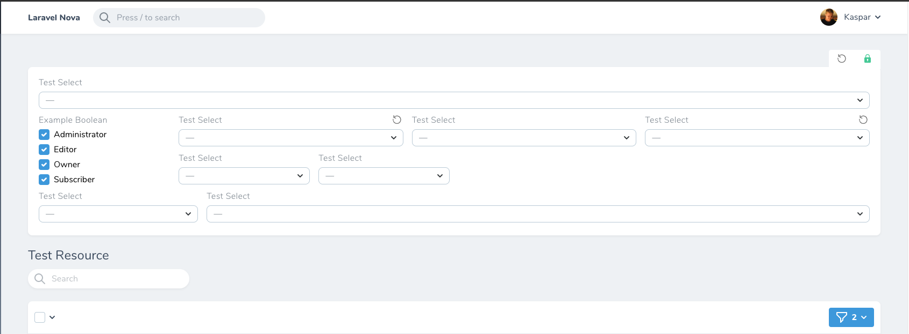

# Nova Detached Filters

[](https://packagist.org/packages/outl1ne/nova-detached-filters)
[](https://packagist.org/packages/outl1ne/nova-detached-filters)

This [Laravel Nova](https://nova.laravel.com/) package allows you to place filters in Nova cards detached from the filter dropdown.

## Features

- Saving filter state
- Reset all and single filters
- Customizable
  - Change width of individual filter
  - Create columns for stacked filters

## Screenshots




## Installation

Install the package in a Laravel Nova project via Composer:

```bash
composer require outl1ne/nova-detached-filters
```

## Usage

Pass the filters you wish to detach from the filter menu and show on a card to `NovaDetachedFilters` class.

```php
use Outl1ne\NovaDetachedFilters\NovaDetachedFilters;

public function filters()
{
    return $this->myFilters();
}

public function cards()
{
    return [
        new NovaDetachedFilters($this->myFilters()),
    ];
}

protected function myFilters()
{
    return [
        new BooleanFilter(),
        new SelectFilter(),
        new PillFilter(),
        // ...
    ];
}
```

## HasDetachedFilters

If you only wish to show some filters on `DetachedFilters` card, you must use `HasDetachedFilters` trait.

```php
use Outl1ne\NovaDetachedFilters\NovaDetachedFilters;
use \Outl1ne\NovaDetachedFilters\HasDetachedFilters;

class ExampleResource extends Resource
{
    use HasDetachedFilters; // Needs to have this trait

    public function cards()
    {
        return [
            new NovaDetachedFilters([
                new SelectFilter, // Showed only on card
                new SelectFilter2, // Showed both in dropdown menu and on card
            ]),
        ];
    }

    public function filters()
    {
        return [
            new SelectFilter2, // Showed both in dropdown menu and on card
            new SelectFilter3 // Shown only in dropdown menu
        ];
    }
}
```

## Customization

### Widths

You can define the width of the filter using `withMeta()`.
To see available width options, check out [Tailwind width classes](https://tailwindcss.com/docs/width#app)

```php
public function cards(Request $request)
{
    return [
        new NovaDetachedFilters([
            (new SelectFilter())->withMeta(['width' => 'w-1/3']),
            (new AnotherSelectFilter())->withMeta(['width' => 'w-2/3']),
        ]),
    ];
}
```

Define the width of the card if you wish to have multiple filter cards side-by-side.
**Width classes should be passed without `w-` in front of it.**

```php
public function cards(Request $request)
{
    return [
        (new NovaDetachedFilters([
            new SelectFilter(),
            new AnotherSelectFilter()
        ]))->width('1/3'),
        (new NovaDetachedFilters([
            new SelectFilter(),
            new AnotherSelectFilter()
        ]))->width('2/3'),
    ];
}
```

### Resetting filter values

If you have bigger filters that take longer to clear manually, you can define `withReset` in filters metadata, that will render a button to easily clear the filters value without affecting other filters.

```php
public function cards(Request $request)
{
    return [
        new NovaDetachedFilters([
            (new SelectFilter())->withMeta(['withReset' => true]),
        ]),
    ];
}
```

If you want to clear all filters, you can call `withReset()` on `NovaDetachedFilters` class. This will render a button on the top-left corner that will clear all filter values.

```php
public function cards(Request $request)
{
    return [
        (new NovaDetachedFilters([
            new SelectFilter(),
        ]))->withReset(),
    ];
}
```

### Storing filter state

When you are working with multiple resources and large group of filters, assigning them every time you navigate is a hassle.
You can call `persistFilters()` function on `NovaDetachedFilters` that will render a lock button top-right corner of the card.
Upon clicking the button, the lock will turn green stating that current filters are saved to `localStorage`.

| Argument            | Default | Description                                                      |
| ------------------- | ------- | ---------------------------------------------------------------- |
| persitFilters       | `true`  | Defines whether persist filters button should be shown.          |
| isPersistingDefault | `false` | Optionally define whether filters should be persisted by default |

```php
public function cards(Request $request)
{
    return [
        (new NovaDetachedFilters([
            new SelectFilter(),
        ]))->persistFilters(),
    ];
}
```

### Collapsing card

If you want to allow collapsing filter card you can call `withToggle()` on`NovaDetachedFilters`.
By default, this is `false`.

```php
public function cards(Request $request)
{
    return [
        (new NovaDetachedFilters([
            new SelectFilter(),
        ]))->withToggle(),
    ];
}
```

### Columns

When working with large boolean filters or pill filters that are the height of multiple regular filters, you can wrap filters inside `DetachedFiltersColumn` to easily wrap them in columns.

`DetachedFilterColumn` class takes two arguments `$filters` and `$width`.
Width of the column will default to `w-auto` if not passed.

Example of this can be seen in [Screenshots section](#Screenshots)

```php
public function cards(Request $request)
{
    return [
        new NovaDetachedFilters([
            new BooleanFilter(),
            new DetachedFilterColumn([
                new SelectFilter(),
                new SelectFilter(),
                new SelectFilter(),
                new SelectFilter()
            ], 'w-2/3'),
        ]),
    ];
}
```

## Credits

- [Kaspar Rosin](https://github.com/kasparrosin)

## License

Nova Detached Filters is open-sourced software licensed under the [MIT license](LICENSE.md).
